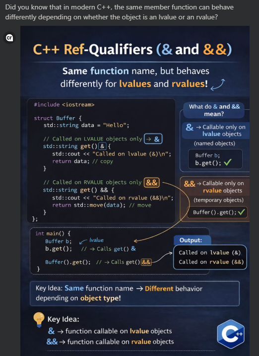

## A nice article on Linkedin


## 1. The code in the image
```c++
#include <iostream>
#include <string>

struct Buffer {
    std::string data = "Hello";

    std::string get() & {
        std::cout << "Called on lvalue (&)\n";
        return data;              // copy
    }

    std::string get() && {
        std::cout << "Called on rvalue (&&)\n";
        return std::move(data);   // move
    }
};

int main() {
    Buffer b;
    b.get();          // lvalue object
    Buffer{}.get();   // rvalue object
}
```
Output:
```
Called on lvalue (&)
Called on rvalue (&&)
```

## 2. First: what are `lvalue` and `rvalue` here?
### Lvalue
An lvalue is an **object with a name/identity**.

Example:
```
Buffer b;
```
`b` is an lvalue.

So:
```c++
b.get();
```
calls the version marked with `&`.

#### Rvalue
An rvalue is a **temporary object**.

Example:
```c++
Buffer{}
```
This is a temporary. So:
```c++
Buffer{}.get();
```
calls the version marked with `&&`.

## 3. What does `get() &` mean?
This part:
```c++
std::string get() &
```
means:
```
this member function can only be called on lvalue objects
```
So:
```c++
Buffer b;
b.get();     // OK
```
But conceptually:
```c++
Buffer{}.get();   // not this overload
```
because **Buffer{} is not an lvalue**.

## 4. What does `get() &&` mean?
This part:
```c++
std::string get() &&
```
means:
```
this member function can only be called on rvalue objects
```
So:
```c++
Buffer{}.get();   // OK
```
because **Buffer{} is a temporary**.

But:
```c++
Buffer b;
b.get();          // not this overload
```
because `b` is an lvalue.

## 5. Why is this useful?

Because **lvalues and rvalues should often be treated differently**.

#### For lvalue object
```c++
std::string get() & {
    return data;
}
```

Here `data` belongs to an object that will **continue to live after the call**.

So returning data by value means:
```
copy the string
```
That is safer, because the original object is still in use.

#### For rvalue object
```c++
std::string get() && {
    return std::move(data);
}
```
Here the **object is temporary and about to die anyway**.

So we can say:
```
take the data out of it
```
This becomes a move, not a copy. That is often faster.

## 6. Why not always `std::move(data)`?
Suppose we did this:
```c++
std::string get() {
    return std::move(data);
}
```
Then even this:
```c++
Buffer b;
auto s1 = b.get();
auto s2 = b.get();
```
would move from `b.data` the first time, and now `b` is left in a moved-from state.

That is usually not what we want for normal named objects.

So the split is:
- lvalue object → copy
- rvalue object → move

## 7. Very important mental model
### `f() &`
```
I am being called on a normal named object.
Please do not steal my internals.
```
### `f() &&`
```
I am being called on a temporary object.
You may steal my internals because I am about to die.
```

## 8. What is the hidden this here?
This becomes clearer if you connect it to `this`.   
Normally, inside a member function, `this` is a **pointer** to the current object.   
With ref-qualifiers, C++ also cares about the **value category of the object*** used for the call.   
So these are like constraints on the implicit object parameter.   
You can think conceptually like this:
```
get() &   -> callable when *this is an lvalue
get() &&  -> callable when *this is an rvalue
```
Not exact syntax, but the right mental model.

## 9. Why return type is still `std::string`, not `std::string&&`?
The function returns:
```c++
std::string
```
not:
```c++
std::string&&
```
Why?

Because returning `std::string&&` here would be dangerous.   
You would be returning a reference to a member inside an object that might die immediately.

Example:
```c++
std::string&& get() && {
    return std::move(data);   // bad idea
}
```
Then:
```c++
auto s = Buffer{}.get();
```
The temporary `Buffer{}` dies, and now that reference would dangle.

So the safe pattern is:
```c++
std::string get() &&
```
**Return a value, but construct it by moving.**

## 10. This is a form of overload resolution
This is just like normal overloading, but based on object category.   
You already know overloads like:
```c++
void f(int);
void f(double);
```
Now this is:
```c++
std::string get() &;
std::string get() &&;
```
Same name, different qualifiers.   
The compiler picks the correct one based on whether the object is lvalue or rvalue.

## 11. Real modern C++ use case
This pattern is useful for classes that hold expensive resources:
- `std::string`
- `std::vector`
- buffers
- builders
- query/result objects
- expression templates
- fluent APIs

Example:
```c++
class Builder {
    std::string result_;

public:
    std::string build() && {
        return std::move(result_);
    }

    std::string build() & {
        return result_;
    }
};
```
Usage:
```c++
Builder b;
auto a = b.build();              // copy
auto c = Builder{}.build();      // move
```

## 12. Full version with `const` too
In real modern C++, you may even see:
```c++
class Buffer {
    std::string data_;

public:
    std::string get() & {
        return data_;
    }

    std::string get() const & {
        return data_;
    }

    std::string get() && {
        return std::move(data_);
    }

    std::string get() const && = delete;
};
```
This is more advanced, but very **common** in polished APIs.

Meaning:
- `&` → non-const lvalue
- `const &` → const lvalue
- `&&` → non-const rvalue
- `const && = delete` → forbid weird calls on const temporaries

## 13. Why `const &&` is often deleted
Because **moving from a const object usually does not make sense**.

Example:
```c++
const Buffer cb;
```
or
```c++
std::move(cb)
```
Since it is const, its internals cannot be modified, so real moving is usually not possible.   
That is why some libraries explicitly disable that case.

## 14. Common beginner mistake
A lot of people think:   
`&&` always means `rvalue reference parameter`.   
But here:
```c++
std::string get() &&
```
it is **not a parameter type**. It is a **member function ref-qualifier**.

So compare:
#### Rvalue reference parameter
```c++
void set(std::string&& s);
```
Here `&&` belongs to the parameter type.

Ref-qualified member function
```c++
std::string get() &&;
```
Here `&&` belongs to the function itself.   
That distinction is very important.

## 15. A clearer example
```c++
#include <iostream>
#include <string>
#include <utility>

class Buffer {
private:
    std::string data_;

public:
    Buffer(std::string s) : data_(std::move(s)) {}

    std::string get() & {
        std::cout << "lvalue version\n";
        return data_; // copy
    }

    std::string get() && {
        std::cout << "rvalue version\n";
        return std::move(data_); // move
    }
};

int main() {
    Buffer b("hello");

    std::string s1 = b.get();                // copy
    std::string s2 = Buffer("world").get();  // move

    std::cout << s1 << '\n';
    std::cout << s2 << '\n';
}
```
Expected behavior:
- `b.get()` uses `&`
- `Buffer("world").get()` uses `&&`

## 16. One more subtle point
Even if a variable's type is `T&&`, the variable itself is usually an **lvalue when named**.

Example:
```c++
Buffer&& x = Buffer{};
x.get();   // x is a named variable -> lvalue
```
So this calls **get() &, not get() &&**.

To call the rvalue overload again:
```c++
std::move(x).get();
```
This is a very common interview trap.